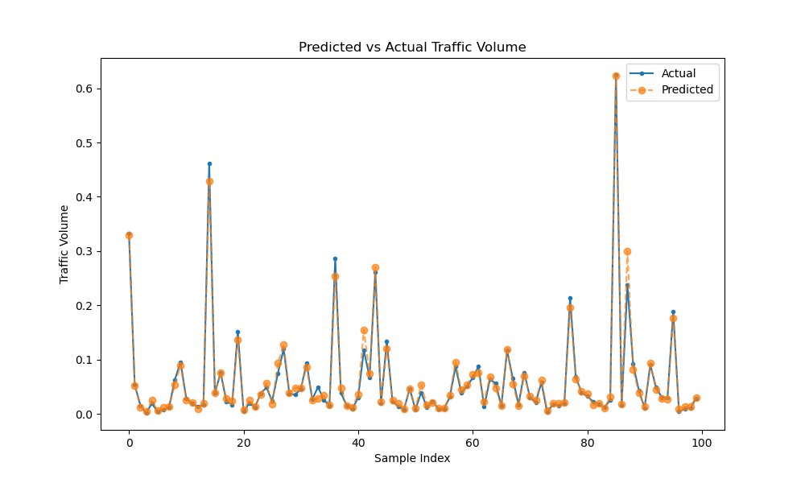
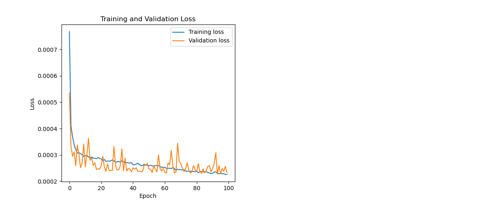
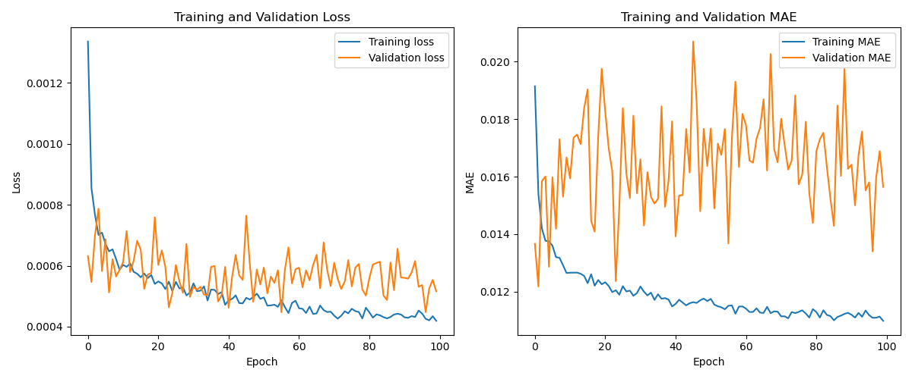

# aiot-traffic-counts
Managing the city traffic base on the the historical traffic count.

# AIOT Traffic Counts Analysis

This repository contains code for exploratory data analysis (EDA) of traffic counts data as part of an AIOT (Artificial Intelligence of Things) project. The goal of this project is to preprocess the data and create an LSTM (Long Short-Term Memory) + Convolutional Neural Network (CNN) model to predict traffic counts and manage traffic efficiently.

## Overview

- `traffic_counts_analysis.ipynb`: Jupyter Notebook containing Python code for EDA of traffic counts data.
- `data.csv`: Sample CSV file containing the raw traffic counts data.
- `README.md`: This file providing an overview of the project.

## Exploratory Data Analysis (EDA)

The `traffic_counts_analysis.ipynb` notebook contains code for performing EDA on the traffic counts data. The analysis includes:
- Data cleaning and preprocessing.
- Visualization of total daily traffic variation.
- Visualization of hourly traffic pattern variation.
- Visualization of direction-wise traffic distribution.
- Correlation heatmap of traffic counts.

## Requirements

To run the code in the notebook, the following Python libraries are required:
- pandas
- matplotlib
- seaborn
- tensorflow
- scikit-learn


## Code Structure

The project is organized into several key directories and files:

- `src/`: Contains Python modules for data preprocessing (`data_preprocessing.py`), model definition (`model.py`), training (`train.py`), and prediction (`predict.py`).
- `data/`: Directory for storing datasets or any data-related files. Initially empty.
- `models/`: Directory for saving trained model files. Initially empty.
- `results/`: Contains output charts and results from model training and predictions.
- `notebooks/`: Jupyter notebooks for exploratory data analysis and example usage.
- `tests/`: Contains unit tests for data preprocessing functions.
- `requirements.txt`: Lists the Python package dependencies for the project.
- `main.py`: The main script for running model training and prediction tasks.

## Model Training and Prediction

The LSTM + Conv model is implemented in `src/model.py` and trained using the `src/train.py` module. The `main.py` script orchestrates the data preprocessing, model training, and prediction process, leveraging command-line arguments for flexibility.

To run the training process, execute the following command:

```bash
python main.py --datafile /path/to/your/data.csv
```

## Output Charts

Generated in the `results/` directory after model execution:

### Predicted vs Actual Traffic Volume



This chart compares the actual and predicted traffic volume, showcasing the model's prediction accuracy.

### Predicted vs Actual Traffic Volume LSTM + Conv


This chart emphasizes the predictions made by the LSTM + Conv model, illustrating how closely the model's predictions align with the actual traffic volumes.

### Training and Validation Loss



This chart shows the training and validation loss over epochs, providing insight into the model's learning process and how well it generalizes to unseen data.

### Training Loss Mean Conv LSTM



This chart highlights the mean training loss for the Conv + LSTM model, demonstrating the model's performance and convergence over time during the training process.


